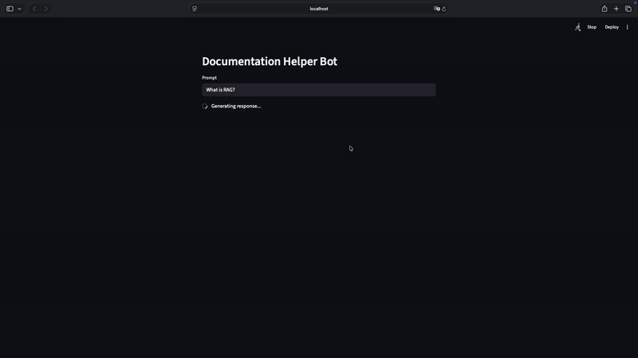

# Documentatio Helper 

Documentation Helper is a lightweight tool that automates the process of extracting, embedding, and querying documentation.
It includes:

- A Streamlit-based user interface
- An ingestion pipeline that performs web scraping, embedding generation, and vector storage
- A backend module that interacts with an LLM provider (Gemini) and vector database (Pinecone)

Installation and execution via uv. This project is designed to provide a simple interface for loading external documentation sources and querying them through an LLM-powered retrieval flow.



## Requirements

- Python 3.10 or higher
- uv (Python package and environment manager)
- Pinecone API key
- Gemini API key (Google Generative AI)
- Ollama for the embedding

## Environment Variables

Environment variables must be defined inside a `.env` file located at the root of the project.

Create a `.env` file with the following content:

```
PINECONE_API_KEY=your_pinecone_key
GEMINI_API_KEY=your_gemini_key
```
## Project Structure

```plaintext
documentation-helper/
│
├── backend/             # LLM and retrieval logic
├── ingestion.py         # Web scraping and embedding pipeline
├── main.py              # Streamlit graphical UI
├── pyproject.toml
├── uv.lock
└── README.md
 ```

## Installation
Clone the repository:
```bash
git clone https://github.com/Pedro1697/documentation-helper.git
cd documentation-helper
```

Install dependencies using uv:
```
uv sync
```

## Running the Application

The application uses Streamlit as the main interface. Start it with:
```
uv run streamlit run main.py

```

This launches the Streamlit UI, where you can:

- You can chat with Chatbot interface to ask question about Langchain
- Run the scraping and embedding process
- Query the resulting knowledge base using the LLM

## Licencese 
This project is licensed under the MIT License. See the LICENSE file for details.


